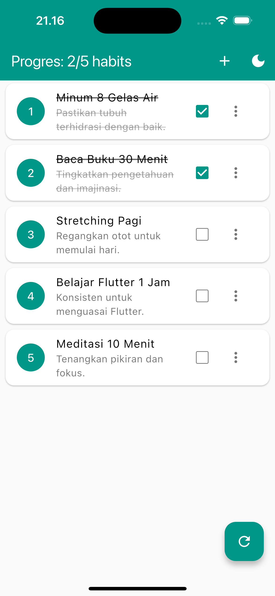

# Mini Habit Tracker

Muhamad Farhan - 4522210057

## Uji Aplikasi

1. **Uji Strikethrough:** <br>
   <br>
2. **Uji Tambah Habit:** <br>
   a. Klik tombol + di AppBar. <br>
   <br>
   b. Coba simpan tanpa mengisi nama (validasi harus mencegah).<br>
   <br>
   c. Isi form dan simpan. Verifikasi habit baru muncul di list.<br>
   <br>
4. **Uji Edit Habit:** <br>
   a. Klik menu tiga titik pada habit, pilih "Edit".<br>
   <br>
   b. Dialog harus muncul dengan data habit tersebut.<br>
   <br>
   c. Ubah nama/deskripsi dan simpan. Verifikasi perubahan di list.<br>
   <br>
5. **Uji Hapus Habit:** <br>
   a. Klik menu tiga titik pada habit, pilih "Hapus".<br>
   <br>
   b. Dialog konfirmasi harus muncul. Coba batalkan.<br>
   //<br>
   c. Coba hapus lagi dan konfirmasi. Verifikasi habit hilang dari list.<br>
   <br>
6. **Uji Progress Bar:** <br>
   <br>
7. **Uji Reset:** <br>
   <br>
8. **Uji Ephemeral State:** <br>
   <br>
9. **Amati Output print:** <br>
   <br>

## Langkah-Langkah Menjalankan Project
Pastikan kamu sudah menginstall dependensi terlebih dahulu:

```bash
flutter pub get
```

Jalankan aplikasi:

```bash
flutter run
```
